# WebSite Making 2018

*Forth, responsive, website created using JavaScript and jQuery made in my second year of studying.*

## Website Desing

### *Landing page*

Landing page of the website. All the next animations are made with plain HTML, CSS and JS.

### *Notification page*
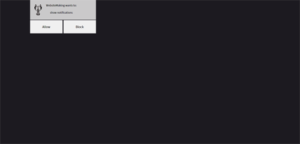

### *Home change page*
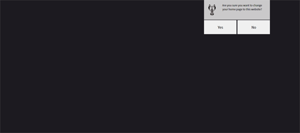

### *Over 18 page*
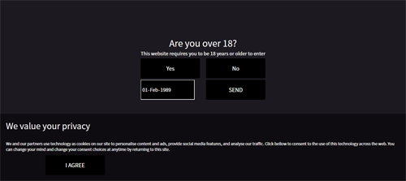

### *City page*
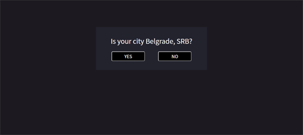

### *Newsletter page*

### *Ad blocker page*
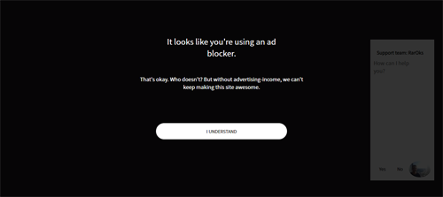

### *Find everything page*
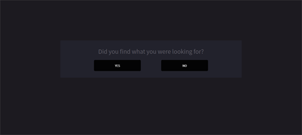

### *Snap page*
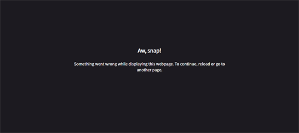

### *Socials page*
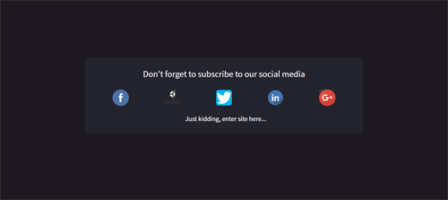

### *Home page*
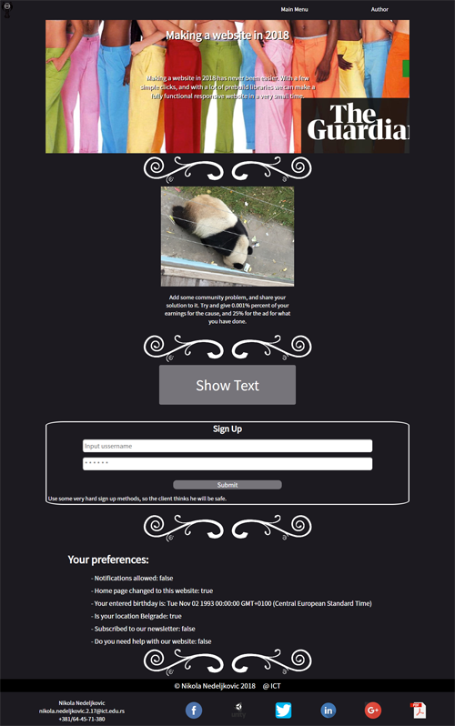

A page with a lot of JS and jQuery animations.

### *Load Author page*
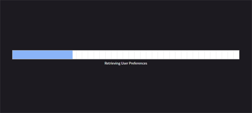

JS animation of loading bar using jQuery, Ajax and JS.

### *Author page*
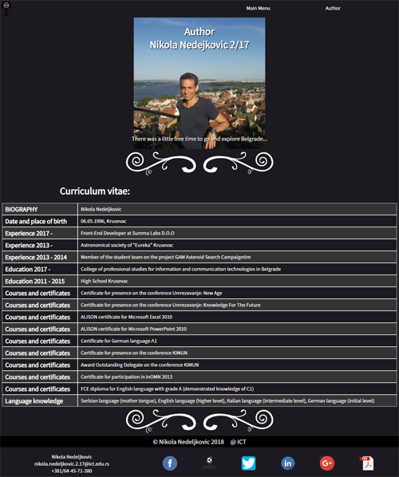

Author page with dinamic CV.